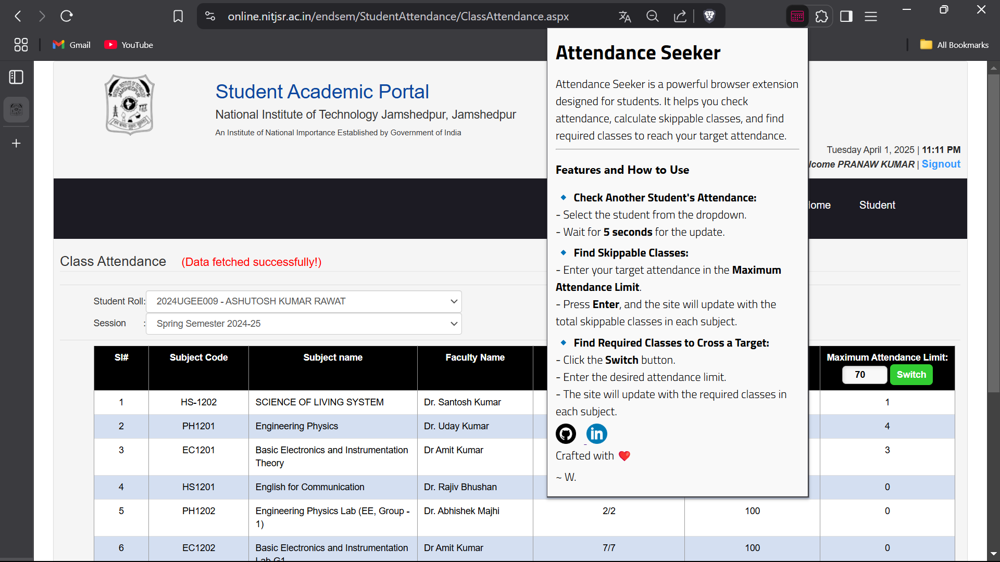

# Attendance-Seeker

Attendance Seeker is a powerful browser extension designed for students. It helps you check attendance, calculate skippable classes, and determine how many more classes are needed to reach your target attendance. 

Works on: [NIT JSR Attendance Website](https://online.nitjsr.ac.in/endsem/StudentAttendance/ClassAttendance.aspx)

---

## Extension Setup

Follow these simple steps to install **Attendance-Seeker**:

1. **Download the .zip file** from the [releases section](https://github.com/prana-W/Attendance-Seeker/releases/download/v1.4/Attendance-Seeker.zip).

2. **Save the ZIP file** to your computer and extract it.
3. **Open Chrome (or your default browser)** and go to:  
   `chrome://extensions/`
4. **Enable Developer Mode** by toggling the switch at the top-right of the page.
5. Click the **Load unpacked** button.
6. **Select the extracted folder** where you saved the extension files.
7. The extension will now be **active in your browser**.

---

## How to Use

### 🔹 Check Another Student's Attendance
- Select the student from the dropdown menu.

- Wait for about **5 seconds**, and the site will update with their attendance.

### 🔹 Find Skippable Classes
- Enter your target attendance in the **Maximum Attendance Limit** section.

- Press **Enter**, and the site will update with the **total classes you can skip** in each subject.

### 🔹 Find Required Classes to Cross a Target
- Click the **Switch** button.

- Enter the desired attendance limit.
- The site will update with the number of **classes required** to cross the entered limit in each subject.

---

## What's New?

### **v1.1 (30/01/25)**  
- Introduced **Class Skip Limit** (80%).

### **v1.2 (02/02/25)**  
- You can now **choose any desired Class Skip Limit**!  

- Changed the **boring static clock** on the website.

### **v1.3 (10/02/25)**  
- You can now **check how many classes are required** to cross your desired attendance by clicking the **Switch** button.

- Added an **icon** for the extension.
- Updated the **PopUp window** for a better user experience.

### **v1.4 (01/04/25)**  

- Stored classLimit and classDeprived limits in local storage.

- Improved the styling in various component and pop-up.

---

## Screenshots

### Default View  

### Selecting a Student  

### Final Attendance  

### Switching Mode  

### Pop-Up

---

*Crafted with ❤️ by W.*   