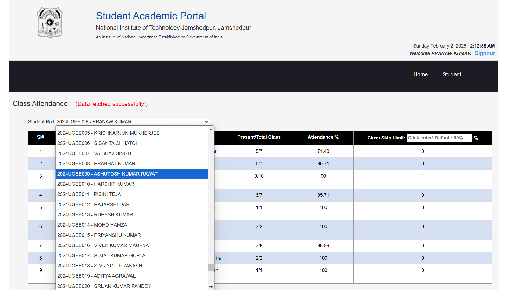

# Attendance-Seeker

This repo contains the extension to check the attendance of any student in <a href = "https://online.nitjsr.ac.in/endsem/StudentAttendance/ClassAttendance.aspx">NIT JSR attendance website</a>
 

<h2>Extension Setup</h2>

1. Download <a href = "https://github.com/prana-W/Attendance-Seeker/releases/download/v1.0/Attendance-Seeker.zip">.zip</a>  file from the releases.
2. Save the ZIP file to your computer and extract the folder in your desired location.
3. Open Chrome (or your default browser) and go to chrome://extensions/.
4. Enable Developer Mode by toggling the switch at the top-right.
5. Click the Load unpacked button.
6. Select the extracted folder where you saved or extracted the extension files.
7. The extension will automatically be active in your browser.

That's it!

<h2>How to use?</h2>

1. You can select any desired roll number from the dropdown as shown in the image below.
2. After selecting, wait for about 7 seconds (as it takes time from fetching data from the server)
3. The attendance table automatically gets updated!

<h2>What's new?</h2>

Now, you can check how many classes you can skip to still maintain 80%+ attendance!!

Change the boring static clock on the website!

 

 

