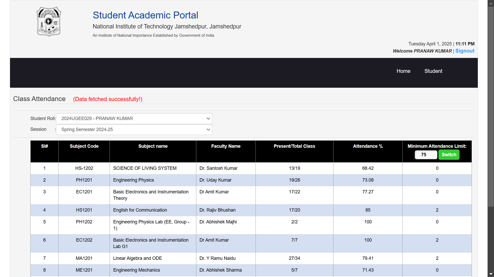
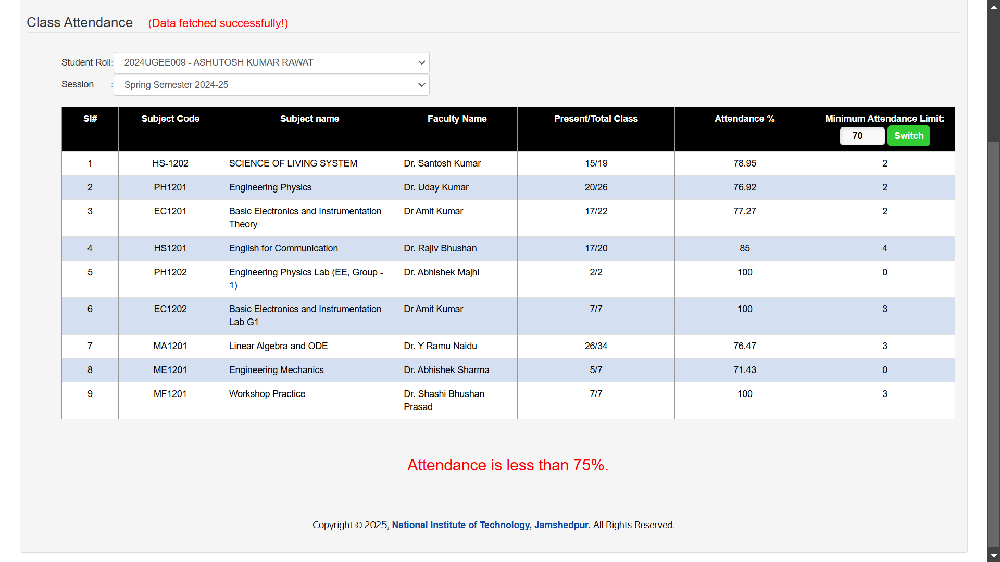

# Attendance-Seeker

Master your attendance game! Check others' attendance, plan your class
      skips wisely, and see how many more you need to hit your
      target—effortlessly! Works on: <a href = "https://online.nitjsr.ac.in/endsem/StudentAttendance/ClassAttendance.aspx">NIT JSR attendance website</a>
 

<h2>Extension Setup</h2>

1. Download <a href = "https://github.com/prana-W/Attendance-Seeker/releases/download/v1.3/Attendance-Seeker.zip">.zip</a>  file from the releases.
2. Save the ZIP file to your computer and extract the folder in your desired location.
3. Open Chrome (or your default browser) and go to: <pre>chrome://extensions/</pre>
4. Enable Developer Mode by toggling the switch at the top-right.
5. Click the Load unpacked button.
6. Select the extracted folder where you saved or extracted the extension files.
7. The extension will automatically be active in your browser.

That's it!

<h2>How to use?</h2>

1. You can select any desired roll number from the dropdown as shown in the image below.
2. After selecting, wait for about 7 seconds (as it takes time from fetching data from the server)
3. The attendance table automatically gets updated!

<h2>What's new?</h2>

<h3>v1.1 (30/01/25)</h3>
<ul>
<li>Introduced Class Skip Limit (80%) </li>
</ul>

<h3>v1.2 (02/02/25)</h3>
<ul>
<li>You can choose any desired Class Skip Limit!</li>
<li>Changed the boring static clock on the website.</li>
</ul>

<h3>v1.3 (10/02/25)</h3>
<ul>
<li>You can now check how many classes are required to cross your desired attendance (by default: 75%) by clicking on "Switch" button in the last table cell.</li>
<li>Added an icon for the extension.</li>
<li>Updated the PopUp window.</li>
</ul>

 

 

 

